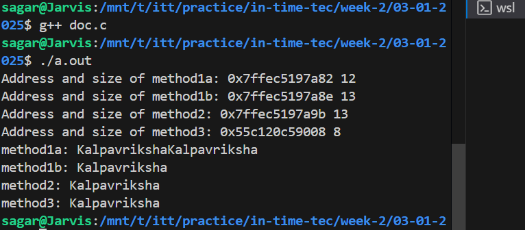

```
char name[12] = {'K', 'a', 'l', 'p', 'a', 'v', 'r', 'i', 'k', 's', 'h', 'a'};
```

This is like a way to initialize an array with the chracters provided. This case it doesnt have null-terminator (\0) added and also it can't be automatically added like in normal cases as the size of the array is less, so it does not function as a proper C string. Its length is fixed at 12 characters, and attempting to use string functions like strlen() can result in undefined behavior. This method is inefficient due to manual initialization and the lack of automatic null-termination whichc is like crucial to identify the end of string.

```
char name[] = "Kalpavriksha"; 
```
This an array with a string literal, and the compiler automatically adds a null-terminator at the end. The size is automatically set to 13 characters (12 for the string plus 1 more for the null-terminator). This method allows the string to be modified and is suitable for C string functions. It is more efficient than manually initializing characters since the compiler handles the size and null-termination.

```
char *name = "Kalpavriksha"; 
```
This a pointer to a string literal. The string is stored in read-only memory, so attempting to modify its contents results in undefined behavior. Its length is determined by the null-terminator at runtime. This method is efficient for read-only strings as it saves stack space and has minimal initialization overhead, but it is not modifiable.

In terms of efficiency, using char *name is the most efficient for static read-only strings. Using char name[] is best if the string needs to be modified. Manually initializing the array is the least efficient approach.


